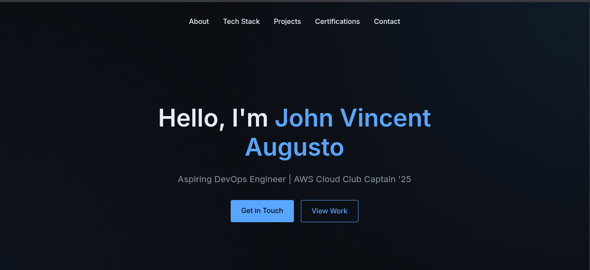

# DevOps Portfolio Website 🚀

[](https://your-portfolio-url.com)
[](https://choosealicense.com/licenses/mit/)

A modern, responsive portfolio website showcasing my journey as a DevOps Engineer and AWS Cloud Club Captain. Built with pure HTML, CSS, and JavaScript, featuring a sleek dark theme and interactive elements.



## ✨ Features

- 🌙 Modern dark theme with glass-morphism effects
- 🎯 Responsive design that works on all devices
- ⚡ Zero-dependency, pure HTML/CSS/JS implementation
- 🔧 Interactive tech stack showcase
- 📊 Real-time GitHub repository stats integration
- 🎨 Smooth animations and transitions
- 💻 Terminal-styled UI elements
- 🌐 Dynamic particle background

## 🛠️ Tech Stack

- HTML5 for semantic structure
- CSS3 with modern features like:
  - CSS Grid and Flexbox
  - CSS Variables
  - Glass-morphism effects
  - Responsive design
- Vanilla JavaScript for interactivity
- GitHub API integration
- SVG icons for crisp graphics

## 🚀 Quick Start

1. Clone the repository:
   ```bash
   git clone https://github.com/gauciv/web-portfolio.git
   ```

2. Navigate to the project directory:
   ```bash
   cd web-portfolio
   ```

3. Open index.html in your browser or use a local server:
   ```bash
   # Using Python
   python -m http.server 8000
   
   # Using Node.js
   npx serve
   ```

4. Visit `http://localhost:8000` in your browser

## 📁 Project Structure

```
web-portfolio/
├── index.html              # Main HTML file
├── assets/                 # Static assets
│   ├── icons/             # SVG icons
│   └── images/            # Images
├── styles/
│   └── main.css          # Main stylesheet
├── scripts/
│   ├── animations.js     # Scroll and UI animations
│   ├── particles.js      # Background particle effects
│   ├── navigation.js     # Smooth scrolling
│   ├── filter.js        # Project filtering
│   └── github-integration.js  # GitHub API integration
└── README.md
```

## ⚙️ Implementation Details

### Performance Optimizations
- Lazy loading of images
- Optimized SVG icons
- Efficient CSS animations using transform
- Debounced scroll events
- Minimal dependencies

### Browser Support
- Chrome (latest)
- Firefox (latest)
- Safari (latest)
- Edge (latest)

## 🎨 Customization

1. Colors: Edit CSS variables in `styles/main.css`:
   ```css
   :root {
       --bg-primary: #0a0c10;
       --accent: #58a6ff;
       /* ...other variables */
   }
   ```

2. Content: Update your information in `index.html`

3. Particle Effects: Adjust settings in `scripts/particles.js`

## 📜 License

This project is open source and available under the [MIT License](LICENSE).

## 🤝 Contributing

Contributions, issues, and feature requests are welcome! Feel free to check the [issues page](https://github.com/gauciv/web-portfolio/issues).

## 📬 Contact

John Vincent Augusto - [@gauciv](https://github.com/gauciv) - jvaugusto30@gmail.com

Project Link: [https://github.com/gauciv/web-portfolio](https://github.com/gauciv/web-portfolio)

---
⭐️ If you found this helpful, please star the repository! ⭐️
